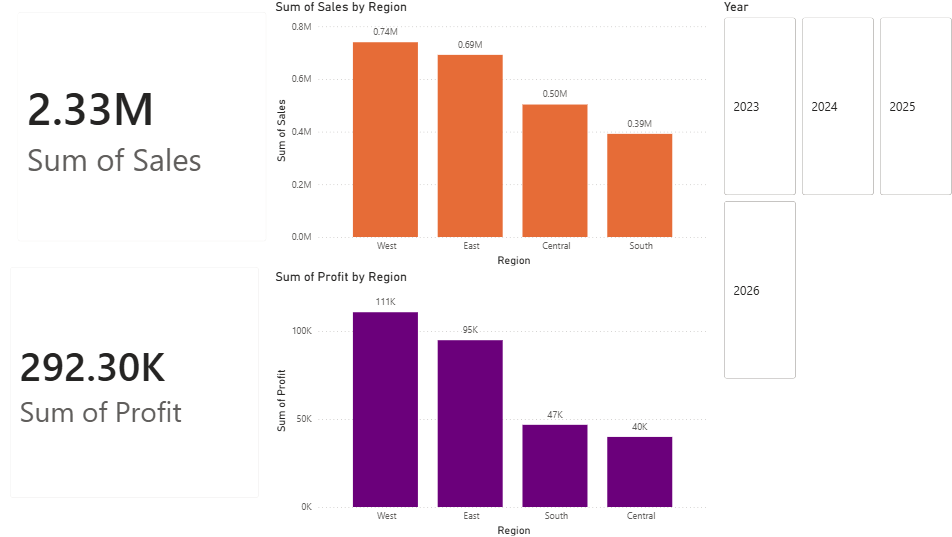
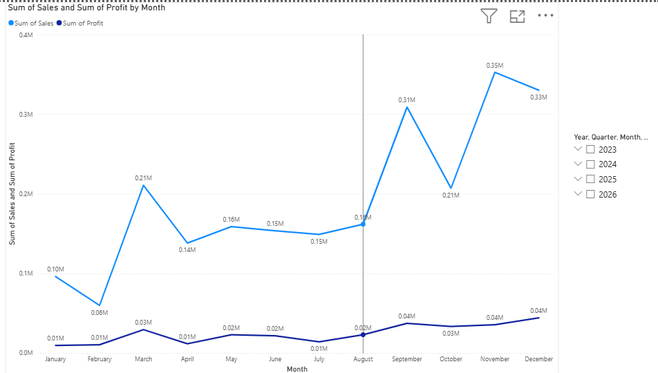
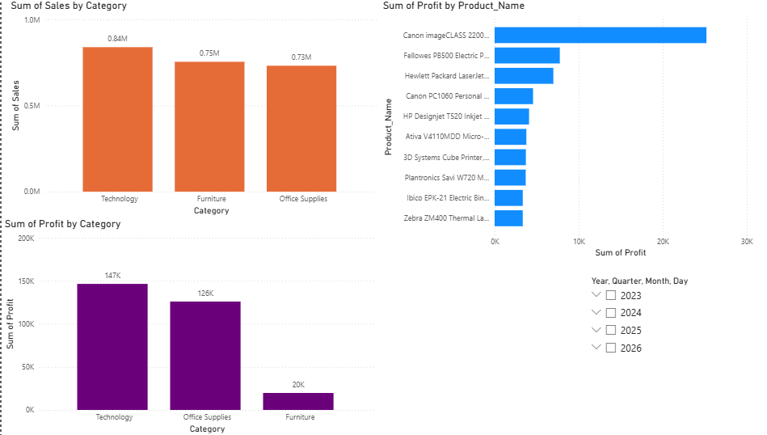
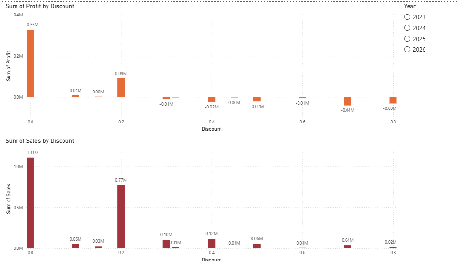

# Retail Sales Analysis Dashboard

## Project Overview

This project analyzes retail sales performance using SQL Server and Power BI. The objective is to identify sales trends, profitability drivers, product performance, and the impact of discounts on business outcomes.

The project includes data cleaning, SQL analysis, and the development of an interactive Power BI dashboard for business reporting and decision-making.

---

## Tools Used

- SQL Server
- Power BI
- GitHub

---

## Data Preparation

- Imported retail sales data into SQL Server.
- Cleaned and transformed raw data using SQL.
- Converted text fields into appropriate numeric and date formats.
- Created an analysis-ready dataset for reporting and visualization.

---

## Business Questions

The analysis focused on answering the following business questions:

1. What are the overall sales and profit figures?
2. How do sales trends change over time?
3. Which product categories generate the most revenue and profit?
4. Which products contribute the highest profit?
5. How do discounts affect profitability?
6. Which regions perform best in terms of sales and profit?

---

## Dashboard Features

### KPI Metrics
- Total Sales
- Total Profit

### Sales Analysis
- Monthly Sales Trend
- Sales by Category
- Sales by Region

### Profitability Analysis
- Profit by Discount
- Top Products by Profit
- Profit by Category

### Interactive Filters
- Year Selector
- Category Filter
- Region Filter

---

## Dashboard Preview

### Dashboard Overview

### Monthly Sales Trend

### Product and Category Analysis

### Discount Analysis

---

## Key Findings

- Sales peaked during the fourth quarter, especially in November.
- Technology products generated the highest profit contribution.
- Higher discount levels were generally associated with lower profitability.
- A large proportion of profits came from transactions with little or no discount.
- Product profitability varied significantly across categories.

---

## Repository Contents

- `RetailSalesDashboard.pbix` — Power BI dashboard file
- `SQLQuery4.sql` — SQL scripts used for data preparation and analysis
- `dashboard_overview.png` — Dashboard overview screenshot
- `sales_trend.png` — Monthly sales trend visualization
- `top_products and category.png` — Product and category analysis
- `profits by discount.png` — Discount impact analysis

---

## Author

Mengxin Yue
